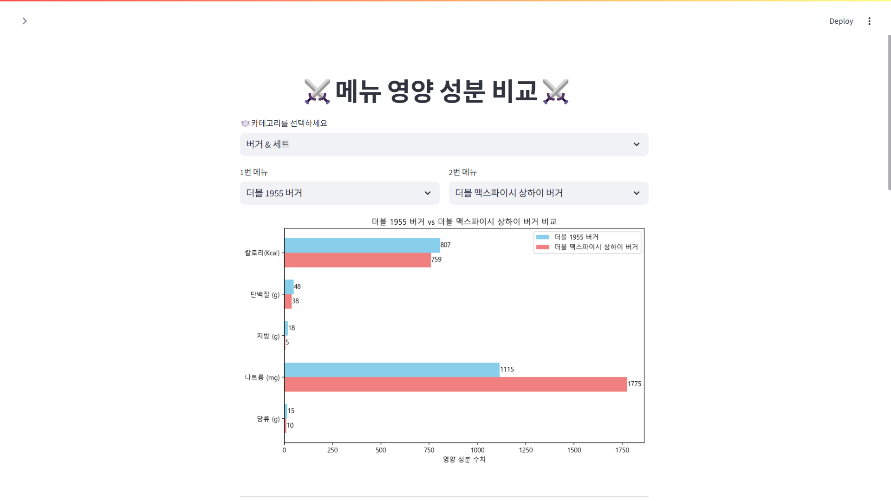
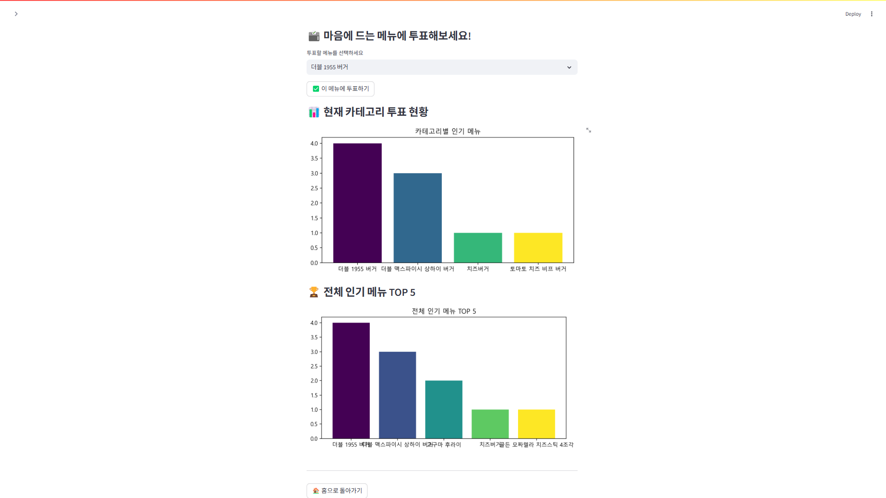
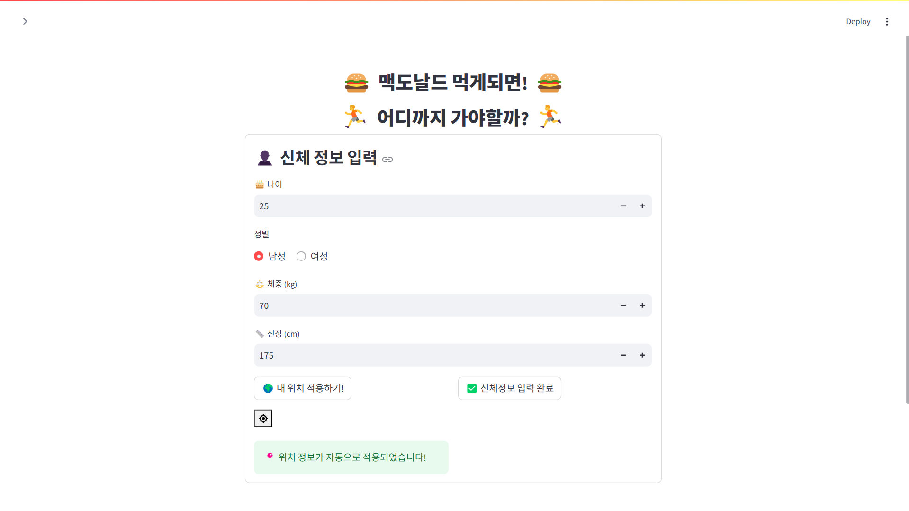
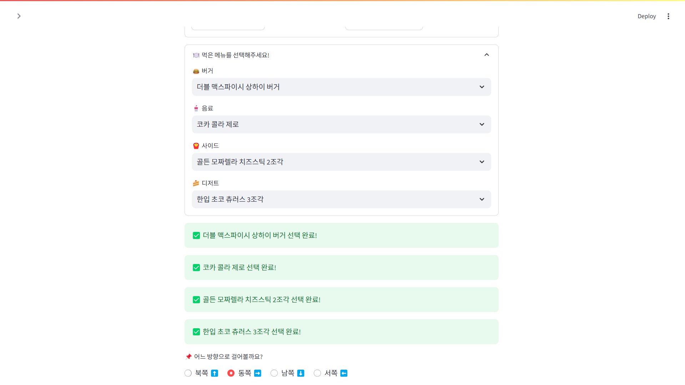
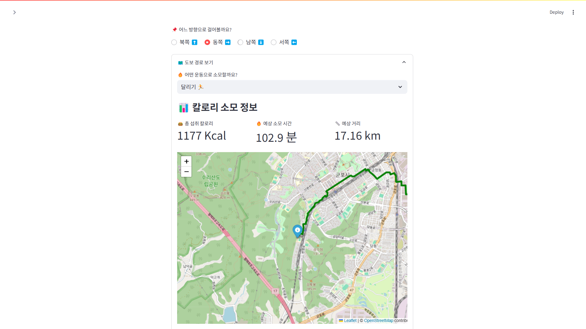
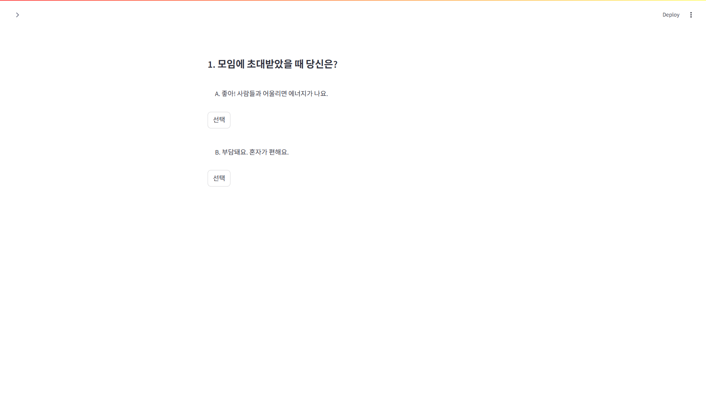
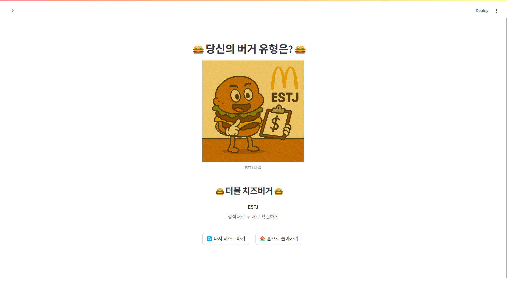
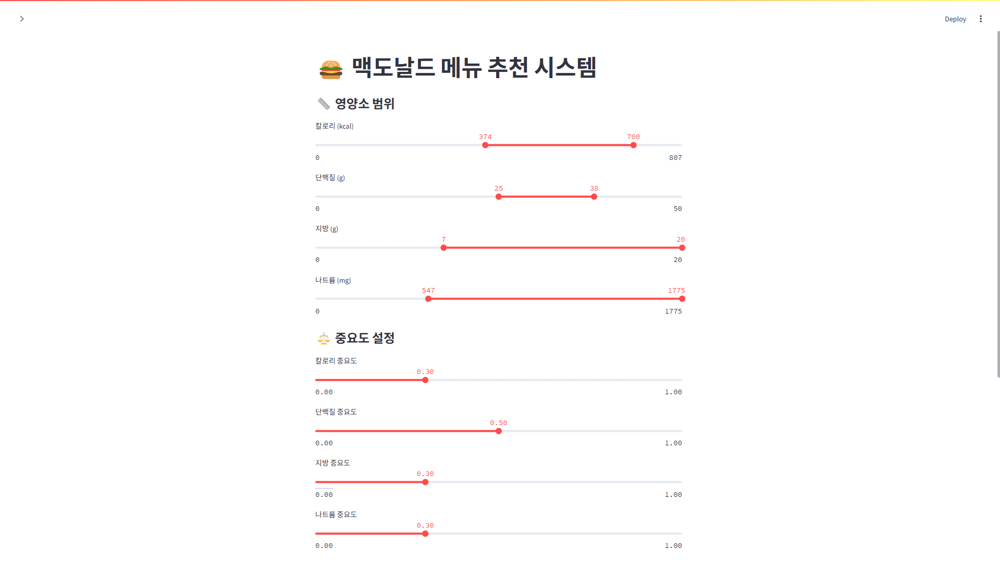
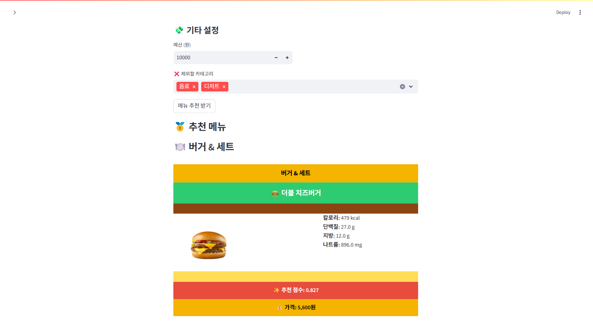
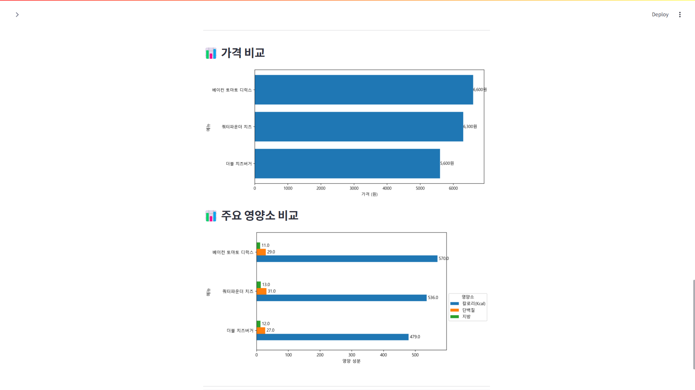

# 햄최몇? (HamHowMany)

[루키즈 개발 트랙 3기] 미니 프로젝트

## 📋 프로젝트 개요
맥도날드 메뉴의 영양성분 비교, 투표, 심리테스트, 사용자 맞춤 메뉴 추천, 칼로리 소모 경로 시각화 등을 제공하는 Streamlit 기반 웹 애플리케이션입니다. `main.py` 실행 시 하위 4개의 페이지(`visual.py`, `map_ui.py`, `mbti.py`, `specialty.py`)가 라우팅되어 순차적으로 접근할 수 있습니다.

## ⭐️ 주요 기능

- **영양 성분 비교 & 투표** (`pages/visual.py`)
  - 메뉴별 칼로리, 단백질, 지방, 나트륨, 당류의 시각적 비교
  - 좋아하는 메뉴에 투표하고 결과를 실시간으로 확인 가능

- **칼로리 소모 지도** (`pages/map_ui.py`)
  - [Nutritionix API](https://www.nutritionix.com/business/api)를 활용, 사용자의 정보를 입력받아 운동량 측정
  - 선택한 메뉴의 총 섭취 칼로리 계산
  - 운동별(걷기/달리기) 예상 소모 시간 및 거리 계산
  - [OpenRouteService API](https://openrouteservice.org/)를 이용한 도보 경로 지도 시각화

- **McBTI 심리 테스트** (`pages/mbti.py`)
  - 12문항 퀴즈를 통해 사용자 MBTI 유형 판별
  - 유형별 추천 버거, 설명, AI생성 이미지 표시

- **영양 기준 추천** (`pages/specialty.py`)
  - 영양 성분 필터링 (칼로리, 단백질, 지방, 나트륨)
  - 사용자 맞춤 중요도 및 예산 설정을 통한 최적 메뉴 추천
  - 추천된 메뉴를 햄버거 형태의 재미있고 독특한 UI로 표현
 
## ⚙️ 개발 환경 및 실행

### 시스템 요구 사항
- Anaconda (Conda 3)
- Python 3.10 이상
- Streamlit
- 그 외 의존성은 requirements.txt 참조
### 1. 레포지토리 클론
```
git clone -b total-feature https://github.com/HamHowMany/main.git
cd main
```
2. Conda 환경 설정
```
conda create -n hamhowmany python=3.10
conda activate hamhowmany
```
3. 의존성 설치
```
pip install -r requirements.txt
```
4. 환경 변수 구성
- 프로젝트 루트에 `.env` 파일을 생성하고 아래 내용을 추가하세요.
```
NUTRITIONIX_APP_ID=your_nutritionix_app_id
NUTRITIONIX_APP_KEY=your_nutritionix_app_key
ORS_API_KEY=your_openrouteservice_api_key
GOOGLE_SERVICE_ACCOUNT_JSON=path/to/your/service_account.json
```
5. 애플리케이션 실행
```
streamlit run main.py
```
- 실행 후 사이드바에서 원하는 페이지(영양 성분 비교, 칼로리 소모 지도, McBTI 심리 테스트, 영양 기준 추천)를 선택해 기능을 이용할 수 있습니다.

### 📁 디렉토리 구조
```
main/
├─ data/
│  ├─ McDelivery Nutritional Information Table.csv    # 맥딜리버리 기준 영양 성분표
│  ├─ Mcdelivery_menu_prices_Kacl.csv                 # 맥딜리버리 기준 가격, 칼로리표
│  ├─ vote_result.csv                                 # 메뉴 투표 결과 파일
│  ├─ burgers.png                                     # MBTI 메인 이미지
│  └─ mbti_images/
│     └─ <MBTI>.png                                   # MBTI 유형별 이미지
│  └─ menu_images/
│     └─ <menu_name>.png                              # 메뉴별 이미지
├─ pages/
│  ├─ visual.py                                       # 영양 성분 비교 & 투표
│  ├─ map_ui.py                                       # 칼로리 소모 지도
│  ├─ mbti.py                                         # McBTI 심리 테스트
│  └─ specialty.py                                    # 영양 기준 메뉴 추천
├─ main.py                                            # 앱 진입점 및 페이지 라우팅
├─ requirements.txt                                   # 의존 패키지 목록
├─ .gitignore
├─ LICENSE                                            # MIT License
└─ README.md
```
## 📸 실행 화면 미리보기

아래는 주요 기능별 실제 실행 화면입니다.

### 🏠 메인 화면

메인 화면에서 사용자는 네 가지 핵심 기능 중 원하는 기능을 선택할 수 있습니다.

### 📊 영양성분 비교 및 투표

각 카테고리에서 두 가지 메뉴를 선택해 칼로리, 단백질, 지방 등 영양 정보를 시각적으로 비교할 수 있습니다.


사용자는 카테고리별로 원하는 메뉴에 대해 세션당 1회 투표가 가능합니다.


### 🏃 칼로리 소모 지도

사용자가 신체 정보를 입력하면 해당 데이터를 기반으로 [Nutritionix API](https://www.nutritionix.com/business/api)를 활용해 운동 소모량을 계산하고, 현재 접속 위치를 바탕으로 대략적인 위치를 파악합니다.


사용자가 선택한 메뉴에 대한 칼로리 정보를 실시간으로 계산하여 제공합니다.


메뉴 칼로리를 기준으로 운동 방식(걷기/달리기)과 이동 방향(동서남북)을 설정하면, 해당 칼로리를 소모하기 위한 운동 경로가 지도에 표시됩니다.

### 🧠 McBTI 심리 테스트 결과

McBTI 심리 테스트의 시작 화면입니다.


위 화면과 같이 두 개의 질문이 제시되며, 버튼을 눌러 하나를 선택하면 MBTI 테스트가 진행됩니다.


MBTI 유형에 따른 추천 버거가 설명 문구와 AI 이미지와 함께 출력되며, '다시 테스트하기' 기능으로 초기 화면으로 돌아갈 수 있습니다.

### 🍔 영양 기준 추천

해당 화면에서는 단백질, 칼로리, 나트륨, 당의 범위와 중요도를 사용자가 직접 설정할 수 있습니다. 중요도는 0.0~1.0 사이의 소수점 단위로 지정됩니다.


영양 성분 기준에 따른 추천 메뉴가 시각적인 이미지와 함께 제공됩니다.


사용자가 선택한 메뉴에 대해 영양 성분 및 가격을 시각적으로 비교할 수 있는 그래프가 표시됩니다.

### 📜 라이선스
[MIT License](https://github.com/HamHowMany/main/blob/main/LICENSE)
